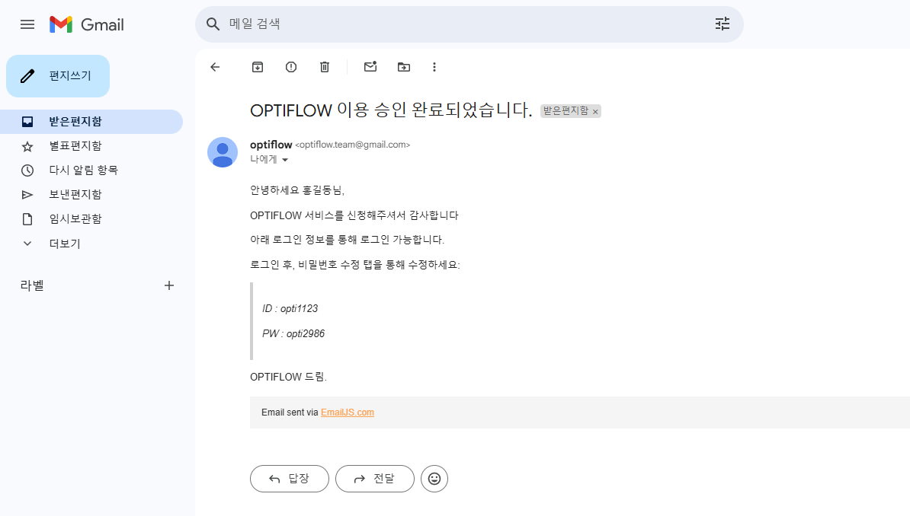
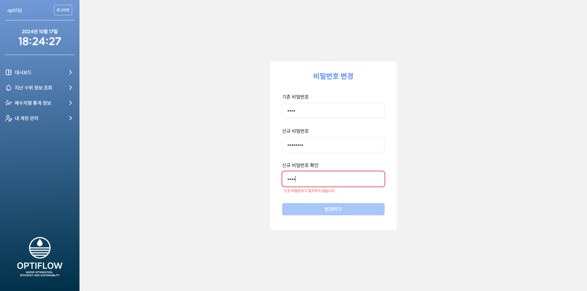
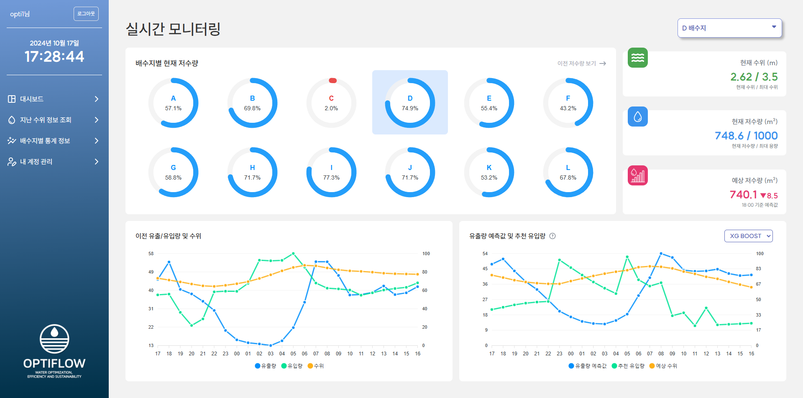
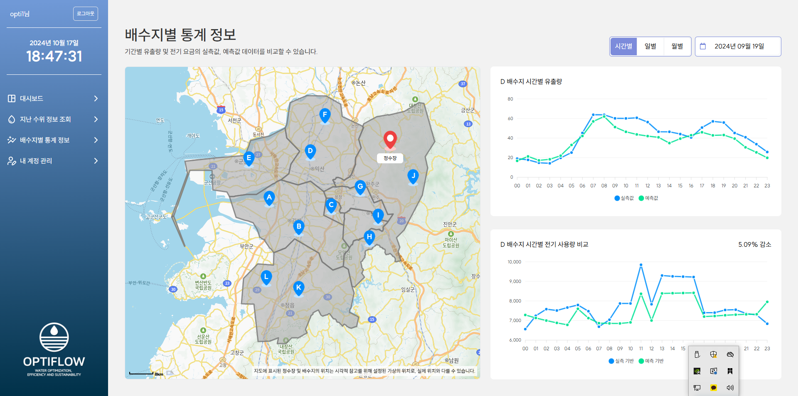

# 💧 OPTIFLOW
[K-Digital 부산대 8회차] AI 활용 빅데이터분석 풀스택웹서비스 SW 개발자 양성과정 AI학습모델 웹서비스 개발 프로젝트
- **주제:** 상수도 시설 모니터링 및 배수지 수요량 예측을 통한 운영 최적화 

 

## 📈 개발 기간
> 2024.01.13 - 2025.02.20.

 

## 👥 팀원 구성
<!-- |이름|담당|GITHUB|
|:------:|:---:|---|
|조은빈|FRONT-END||
|정원영|BACK-END||
|윤찬희|DATA|| -->

|조은빈|정원영|윤찬희|
|:---:|:---:|:---:|
||||
|FRONT-END|BACK-END|DATA|
||| |

 

## 🔧 Stack

### **FRONT-END**
 &nbsp;  &nbsp;  &nbsp;  &nbsp; 

### **BACK-END**
 &nbsp;  &nbsp;  &nbsp; 

### **DATA**
 &nbsp;  &nbsp;  &nbsp;  &nbsp;  &nbsp; 

### **COMMON**
 &nbsp;  &nbsp;  &nbsp; 

 

## ⭐ Main Feature
### 1️⃣ 메인 화면
 &nbsp; &nbsp; 
 &nbsp; &nbsp; 

- Optiflow 주요 서비스 소개

 

### 2️⃣ 이용 신청 / 로그인 / 비밀번호 변경
 &nbsp;  &nbsp; 

- 메인 화면 하단에서 이용 문의 신청 가능 (모달로 구현)
- 이용 신청 후, 관리자 승인 시 이메일을 통해 임시비밀번호 발급 및 안내
- 로그인 후 '내 계정 관리' 탭에서 비밀번호 변경 가능

 

### 3️⃣ 대시보드

- 공통 : 아이콘 클릭 및 SelectBox를 통한 배수지 변경
- 영역 1 : 전체 배수지 현재 수위 실시간 안내
- 영역 2 : 선택된 배수지의 상세 정보 제공 (수위, 현재 저수량, 1시간 뒤 예상 저수량)
- 영역 3 : 지난 24시간 유입량 및 유출량 확인
- 영역 4 : 추후 24시간 예측 유출량 및 추천 유입량 안내 (XG Boost / LSTM 모델 변경 가능)

 

### 4️⃣ 지난 수위 정보 조회

- 모식도 형태로 한 눈에 볼 수 있는 흐름도 제공 (React-Flow 활용)
- 과거 날짜 및 시간 선택시, 해당일의 수위 데이터 안내 
- 각 배수지 hover시, 상세 데이터 안내

 

### 5️⃣ 배수지별 통계 정보

- Kakao Map API를 활용한 위치 안내 
    - 시각적 참고로 위해 가상으로 설치된 위치로, 실제 위치와 다를 수 있습니다.
- 마커 클릭시, 선택되는 배수지 변경
- 시간별, 일별, 월별 통계 정보를 볼 수 있음
- 그래프 1 : 실제 유출량 및 AI모델로 예측된 유출량
- 그래프 2 : 실측 기반 전기 사용량과 AI모델 사용시 예측 되는 전기 사용량

 

### 6️⃣ 관리자 페이지
- 

## 🔨 Server Architecture

## 📋 ERD

## 📋 느낀점